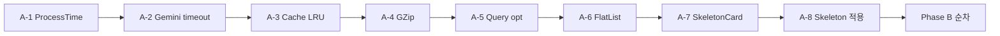

# Codex Skill — PROMETHEUS Performance Optimization

> Codex가 `.ai/plans/2026-02-13_perf_master_plan.md`를 읽고 즉시 실행하기 위한 전용 스킬.
> **핵심 원칙**: 측정 없이 최적화 금지. 성능 목적 외 변경 금지.

---

## 실행 입력

```
실행계획: .ai/plans/2026-02-13_perf_master_plan.md
변경 로그: .ai/reports/2026-02-13_codex_change_log.md
블로커 리포트: .ai/reports/2026-02-13_codex_blockers.md (실패 시 생성)
성능 예산: perf_master_plan.md "성능 예산" 섹션 참조
```

---

## 작업 규칙

### 1 Task = 1 Commit

| 규칙 | 설명 |
|------|------|
| **커밋 단위** | master_plan의 각 Commit (A-1, A-2, ..., B-1, ...) = 1 commit |
| **변경 파일** | ≤ 10개 / commit |
| **성능 전용** | 성능 개선 외 기능 변경·스타일 수정·리팩토링 금지 |
| **추가 발견** | 발견된 비성능 문제는 `.ai/reports/backlog.md`에 기록만 |

### 커밋 메시지 규칙
```
perf(<scope>): <원본ID> <한줄 설명>

Body: (선택)
- before: <지표>
- after: <지표>
```

**스코프**: `api`, `app`, `network`, `build`, `ux`, `observability`, `reliability`

### 실행 순서



Phase B 내에서:
1. B-1~B-6 (프론트 실제 성능: React.memo, useCallback, dedup, Cache-Control)
2. B-7~B-10 (체감속도: 프리페치, 낙관적 UI, 진행 메시지)
3. B-11~B-12 (관측: duration, perf 로깅)
4. B-13~B-15 (가드레일: 캐시 제한, 스모크 벤치, babel)

---

## 테스트 / 벤치 게이트

### 매 커밋 후 반드시 실행

```bash
# 백엔드 테스트
cd prometheus-api && python -m pytest tests/ -v --tb=short

# 프론트엔드 테스트 (jest 인프라 확보 후)
cd prometheus-app && npm test

# 벤치마크 (해당 커밋에 명시된 커맨드)
# 예: hey -n 50 -c 5 -H "X-Device-ID: bench" "$API/api/inventory"
```

### 게이트 규칙

| 상황 | 조치 |
|------|------|
| 테스트 통과 + 벤치 동등/개선 | 다음 커밋 진행 |
| 테스트 통과 + 벤치 악화 ≤ 5% | 경고 기록, 진행 허용 |
| 테스트 통과 + 벤치 악화 > 5% | 원인 분석 → 수정 시도 |
| 1회 실패 | 수정 시도 → 재실행 |
| **2회 연속 실패** | **즉시 중단** → blocker 리포트 생성 |

### 벤치마크 커맨드 참조

| 대상 | 커맨드 |
|------|--------|
| API 벤치 | `hey -n 100 -c 10 -H "X-Device-ID: bench" -H "X-App-Token: $TOKEN" "$API/<path>"` |
| 메모리 | `docker stats --no-stream prometheus-api` |
| gzip 효과 | `curl -sH "Accept-Encoding: gzip" "$API/api/inventory" -o /dev/null -w '%{size_download}'` |
| 번들 크기 | `cd prometheus-app && npx expo export --platform ios && du -sh dist/bundles/` |
| Docker 이미지 | `docker images prometheus-api --format "{{.Size}}"` |
| 프런트 프로파일 | React DevTools Profiler (수동) |

---

## 실패 처리

### Blocker 리포트

**2회 연속 테스트/벤치 실패 시** 생성:

```markdown
# Codex Perf Blockers – 2026-02-13

## Blocker: <커밋 ID>

### 실패 내용
- Task: <A-N 또는 B-N>
- 원본 ID: <BL-001 등>
- 에러: <메시지 또는 벤치 결과>

### 시도한 수정
1. <첫 번째: 무엇을 변경>
2. <두 번째: 무엇을 변경>

### before/after 지표
- before: <조치 전 지표>
- after: <조치 후 지표>

### 예상 원인
- <분석>

### 필요한 조치
- [ ] <인간 확인 사항>
```

---

## 변경 로그

**매 커밋 후 기록** → `.ai/reports/2026-02-13_codex_change_log.md`

```markdown
# Codex Perf Change Log – 2026-02-13

## Commit A-1: perf(api): OM-001 add process-time middleware
- **상태**: ✅ 완료
- **변경 파일**: main.py
- **before**: 응답 시간 측정 불가
- **after**: X-Process-Time 헤더, p95=Xms
- **테스트**: 통과 N/N
- **벤치**: p95=Xms (오버헤드 < 1ms)
```

### 로그 규칙
- 모든 커밋(성공/실패/스킵) 기록
- **before/after 지표 필수** (가능한 경우)
- 스킵 시 사유 명시

---

## 성능 예산 체크

매 Phase 완료 후 성능 예산 확인:

| 지표 | 예산 상한 | 현재 | 상태 |
|------|---------|------|------|
| API p95 (재고) | 500ms | ? | |
| 메모리 RSS | 512MB | ? | |
| FPS (스크롤) | 45+ | ? | |
| JS 번들 | 8MB | ? | |

---

## 안전 규칙

| 규칙 | 설명 |
|------|------|
| 기능 불변 | 성능 이외의 동작 변경 금지 |
| DB 스키마 변경 금지 | (이번 사이클에 없음) |
| `.env` 미커밋 | API 키, 토큰 절대 커밋 금지 |
| 🔴 변경 인간 리뷰 | 타임아웃, 캐시 정책 변경은 리뷰 필수 |
| 롤백 기준 준수 | 예산 초과 시 이전 리비전 복원 |

---

## 완료 조건

- [ ] P0 커밋 8개 완료
- [ ] P1 커밋 15개 완료 (또는 blocker 기록)
- [ ] 전체 테스트 통과
- [ ] 성능 예산 내 유지
- [ ] `.ai/reports/2026-02-13_codex_change_log.md` 기록 완료
- [ ] 미해결 → backlog.md 이관
