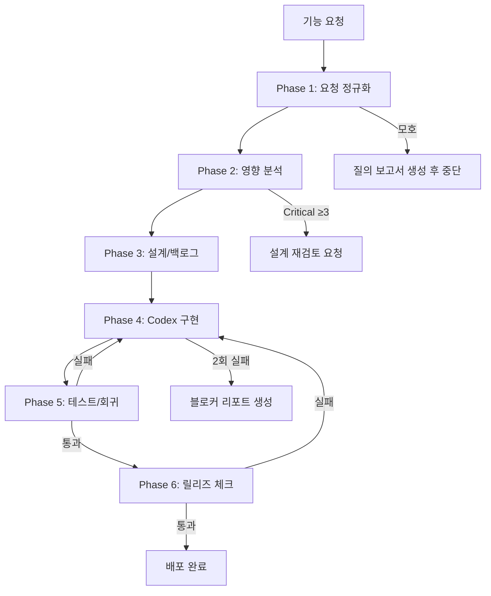

# Feature Enhancement Cycle Workflow

> 기능강화 1사이클을 정의한다. 모든 기능요청은 이 워크플로우를 따라 설계→구현→검증→배포된다.

---

## Assumptions
| 항목 | 가정 | 불확실도 |
|------|------|---------|
| 백엔드 프레임워크 | Python 3.11+ / FastAPI ≥0.115 | 확정 |
| 프론트엔드 | React Native / Expo SDK 52 / TypeScript | 확정 |
| DB | Supabase (PostgreSQL) + RLS | 확정 |
| 배포 | Docker → Google Cloud Run | 확정 |
| 테스트 프레임워크 | pytest(백엔드), jest(프론트) **미구축** | 확정 |
| CI/CD | 미확인 (GitHub Actions 없음) | 높음 |
| Linting | ruff/eslint 설정 미발견 | 중간 |
| 엔트리포인트 (API) | `prometheus-api/app/main.py` | 확정 |
| 엔트리포인트 (앱) | `prometheus-app/app/(tabs)/_layout.tsx` | 확정 |
| 주요 도메인 | 스캔, 재고, 레시피, 장보기, 알림, 통계 | 확정 |

---

## 사이클 단계 (6단계)

### Phase 1: 요청 정규화 (Request Normalization)

**목적**: 자유형 기능요청을 구조화된 유저스토리·수용기준으로 변환

**산출물**:
- 유저스토리 (`As a <role>, I want <goal>, So that <benefit>`)
- 수용기준 (Given/When/Then)
- 엣지케이스 목록
- 영향 범위 예측 (파일/모듈 목록)

**담당 에이전트**: `01_feature_architect`

**완료 조건 (DoD)**:
- [ ] 유저스토리 ≥ 1개 작성
- [ ] 수용기준 ≥ 3개 (happy path + error + edge case)
- [ ] 영향 범위에 파일 경로 최소 1개 이상 명시

**실패 중단 기준**:
- 요구사항이 모호하여 2개 이상 해석 가능 → 질의 보고서 생성 후 중단

---

### Phase 2: 영향 분석 (Impact Analysis)

**목적**: 기능이 기존 코드·데이터·보안·성능에 미치는 영향을 사전 평가

**산출물**:
- 에이전트별 분석 리포트 (02~07)
- 리스크 매트릭스 (사용자 영향 × 기술 위험)
- 의존성 그래프 (변경이 전파되는 모듈 체인)

**담당 에이전트**: `02_uiux`, `03_backend_api`, `04_test_engineering`, `05_observability`, `06_perf_reliability`, `07_security_privacy`

**완료 조건 (DoD)**:
- [ ] 모든 에이전트 리포트 생성 완료
- [ ] 🔴 Critical 항목에 대한 완화 전략 명시
- [ ] 추정 노력도(S/M/L/XL) 부여

**실패 중단 기준**:
- 🔴 Critical이 해결 전략 없이 3개 이상 → 설계 재검토 요청

---

### Phase 3: 설계 / 백로그 (Design & Backlog)

**목적**: 분석 결과를 통합하여 마스터 실행계획을 수립

**산출물**:
- `.ai/plans/YYYY-MM-DD_feature_master_plan.md`
- P0/P1/P2 우선순위 테이블
- 커밋 단위 구현계획

**담당**: 오케스트레이터 (통합)

**완료 조건 (DoD)**:
- [ ] P0 항목 전부 커밋 단위로 분해
- [ ] 각 커밋에 변경 파일·테스트 커맨드·수용기준 명시
- [ ] 롤백 기준 및 절차 명시

**실패 중단 기준**:
- P0에 L/XL 사이즈 작업이 포함된 경우 → 추가 분할 필요

---

### Phase 4: Codex 구현 (Implementation)

**목적**: master_plan을 따라 코드를 커밋 단위로 구현

**산출물**:
- 커밋별 변경 로그: `.ai/reports/YYYY-MM-DD_codex_change_log.md`
- (필요 시) 블로커 리포트: `.ai/reports/YYYY-MM-DD_codex_blockers.md`

**담당**: Codex (`CODEX_Skill.md` 참조)

**원칙 (반드시 강제)**:
1. **작은 커밋**: 1 task = 1 commit, 변경 파일 ≤ 10
2. **테스트 게이트**: 매 커밋 후 테스트 실행, 실패 시 다음 커밋 금지
3. **롤백 준비**: DB 마이그레이션 시 역방향 SQL 동봉

**완료 조건 (DoD)**:
- [ ] master_plan의 모든 P0 커밋 완료
- [ ] 전체 테스트 스위트 통과
- [ ] 변경 로그 기록 완료

**실패 중단 기준**:
- 동일 커밋 2회 연속 테스트 실패 → 중단 + 블로커 리포트 생성

---

### Phase 5: 테스트 / 회귀 (Test & Regression)

**목적**: 변경이 기존 기능을 손상시키지 않음을 확인

**산출물**:
- 테스트 실행 결과 로그
- 커버리지 리포트 (가능한 경우)
- 회귀 체크리스트

**담당 에이전트**: `04_test_engineering`

**테스트 실행 커맨드**:
```bash
# 백엔드
cd prometheus-api && python -m pytest tests/ -v --tb=short

# 프론트엔드
cd prometheus-app && npm test

# 커버리지 (백엔드)
cd prometheus-api && python -m pytest --cov=app --cov-report=term-missing
```

**완료 조건 (DoD)**:
- [ ] 모든 기존 테스트 통과
- [ ] 신규 테스트 추가 (변경 기능별 최소 1개)
- [ ] 🔴 변경에 대해 단위+통합 테스트 존재

**실패 중단 기준**:
- 회귀 테스트 실패 → Phase 4로 회귀

---

### Phase 6: 릴리즈 체크 (Release Check)

**목적**: 배포 전 최종 안전 점검

**체크리스트**:
- [ ] 모든 P0 커밋 머지됨
- [ ] `.env`/시크릿 커밋 없음
- [ ] Dockerfile 빌드 성공
- [ ] 헬스체크 엔드포인트 응답 확인
- [ ] 기능 플래그 기본값 확인 (신규 기능 OFF)
- [ ] CORS 설정 프로덕션 적합
- [ ] 롤백 예행 확인 (이전 리비전 배포 가능)

**완료 조건 (DoD)**:
- [ ] 체크리스트 전항목 통과
- [ ] 배포 승인자 확인

**실패 중단 기준**:
- 체크리스트 1개라도 미통과 → 배포 금지, 원인 파일링

---

## 사이클 다이어그램



---

## 핵심 원칙 요약

| 원칙 | 설명 |
|------|------|
| 작은 커밋 | 1 task = 1 commit, 변경 파일 ≤ 10 |
| 테스트 게이트 | 매 커밋 후 테스트 실행 필수, 실패 시 다음 단계 진입 금지 |
| 롤백 우선 | DB 스키마 변경 시 역마이그레이션 SQL 필수 동봉 |
| 기능 플래그 | 신규 기능은 환경변수 플래그로 제어, 기본 OFF |
| 관측 가능성 | 변경마다 로그/메트릭 포인트 확인 |
| 보고 의무 | 모든 산출물은 `.ai/` 하위에 날짜 기반 파일명으로 보존 |
