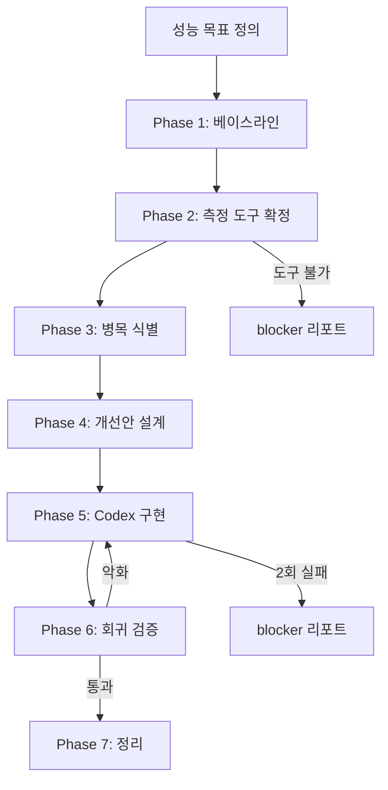

# Performance Optimization Cycle Workflow

> 성능/체감속도 최적화 1사이클을 정의한다. **"측정 없이는 최적화 금지"** 원칙을 강제한다.

---

## Assumptions
| 항목 | 가정 | 확정도 |
|------|------|--------|
| 백엔드 | Python 3.11+ / FastAPI ≥0.115 / uvicorn | ✅ |
| 프론트엔드 | React Native / Expo SDK 52 / TypeScript | ✅ |
| DB | Supabase (PostgreSQL) + RLS | ✅ |
| 배포 | Docker → Google Cloud Run | ✅ |
| 테스트 | pytest(미구축), jest(미구축) | ✅ |
| CI/CD | 미확인 | ⚠️ |
| APM/모니터링 | 없음 | ✅ |
| 프로파일러 | React DevTools Profiler (사용 가능), py-spy/cProfile (설치 필요) | 가정 |
| 번들 분석 | expo-cli `npx expo export` 가능 | 가정 |
| 성능 예산 | 미정의 (본 사이클에서 초안 수립) | ✅ |

### 핫패스(Hot Path) 후보
| 경로 | 프론트엔드 | 백엔드 |
|------|-----------|--------|
| 앱 시작 → 첫 화면 | Expo Splash → 탭 로드 → 재고 fetch | — |
| 스캔 → 결과 | 카메라 → 업로드 → Gemini 분석 → 결과 | `scans.py` → `gemini_service.py` |
| 레시피 추천 | 화면 진입 → API 호출 → 카드 렌더 | `recipes.py` → `recipe_cache.py` → Gemini |
| 재고 목록 스크롤 | FlatList 렌더 → 페이징 | `inventory.py` → `inventory_service.py` |
| 장보기 체크아웃 | 버튼 → API → 재고 반영 | `shopping.py` → `inventory_service.py` |

---

## 성능 개선 패턴 분류

### 실제 성능 (Actual Performance)
| 패턴 | 설명 |
|------|------|
| 쿼리 최적화 | SELECT *, N+1, 인덱스, 컬럼 지정 |
| 병렬화 | 직렬 → asyncio.gather |
| 메모리 최적화 | 스트리밍 I/O, 캐시 크기 제한 |
| 렌더 최적화 | useMemo/useCallback, FlatList 가상화 |
| 번들 최적화 | 트리쉐이킹, 동적 import, 이미지 압축 |

### 체감속도 (Perceived Speed)
| 패턴 | 설명 |
|------|------|
| 스켈레톤/플레이스홀더 | 데이터 로딩 전 레이아웃 표시 |
| 낙관적 UI | 서버 응답 전 즉시 반영 |
| 우선순위 렌더 | Above-the-fold 우선, 나머지 지연 |
| 프리페치 | 다음 화면 데이터 사전 로드 |
| 점진적 로딩 | 핵심 → 부가 순차 로드 |

---

## 사이클 7단계

### Phase 1: 베이스라인 정의 (Baseline)

**목적**: 현재 성능 지표를 정량화하여 개선 기준선 수립

**산출물**:
- 핵심 지표 목록 + 현재값(또는 측정 계획)
- 측정 도구/커맨드 확정

**완료조건 (DoD)**:
- [ ] 핵심 지표 ≥ 5개 정의
- [ ] 각 지표에 측정 도구/커맨드 명시
- [ ] 불가능한 지표에 대해 대안 제시

**실패 중단**: 측정 도구를 확정할 수 없는 경우 → 도구 설치 Task를 P0으로 선행

---

### Phase 2: 측정 도구/커맨드 확정 (Instrumentation)

**목적**: 프로파일러, 벤치마크, 메트릭 수집 도구 설치 및 실행 확인

**산출물**:
- 도구 목록 + 설치/실행 커맨드
- 베이스라인 측정 결과 (가능한 경우)

**완료조건 (DoD)**:
- [ ] 모든 도구 설치 커맨드 확인
- [ ] 최소 1개 지표 실제 측정 완료

**실패 중단**: 도구 설치가 환경 제약으로 불가 → 대안 도구 제안 + blocker 리포트

---

### Phase 3: 병목 식별 (Bottleneck Analysis)

**목적**: 에이전트별 분석으로 성능 병목 위치와 원인 파악

**산출물**:
- 에이전트별 리포트 (01~08)
- 병목 우선순위 매트릭스 (영향 × 수정 용이성)

**담당 에이전트**: 01~08 전체

**완료조건 (DoD)**:
- [ ] 모든 에이전트 리포트 생성
- [ ] 각 Finding에 파일/함수/라인 근거 명시
- [ ] 추정 영향(ms/MB/FPS) 제시

**실패 중단**: 🔴 Critical이 해결 전략 없이 3개 이상 → 설계 재검토

---

### Phase 4: 개선안 설계 (Design)

**목적**: 병목별 개선안을 커밋 단위로 분해, 마스터 플랜 수립

**산출물**: `.ai/plans/2026-02-13_perf_master_plan.md`

**완료조건 (DoD)**:
- [ ] P0 항목 커밋 단위 분해 완료
- [ ] 각 커밋에 벤치마크 수용기준(before/after) 명시
- [ ] 성능 예산 초안 정의

**실패 중단**: P0에 XL 작업 포함 → 추가 분할

---

### Phase 5: Codex 구현 (Implementation)

**목적**: master_plan 커밋 순서대로 구현

**원칙**:
1. **1 task = 1 commit**, 변경 파일 ≤ 10
2. **성능 목적 외 변화 금지**: 기능 변경·스타일 변경 불가
3. **매 커밋 후 테스트+벤치 실행** (테스트 게이트)
4. **2회 연속 실패 → 중단 + blocker 리포트**

**산출물**:
- `.ai/reports/2026-02-13_codex_change_log.md`
- (실패 시) `.ai/reports/2026-02-13_codex_blockers.md`

---

### Phase 6: 성능 회귀 검증 (Regression Check)

**목적**: 전후 지표 비교로 개선 효과 확인, 회귀 없음 증명

**산출물**:
- 전후 지표 비교 테이블
- 회귀 테스트 결과

**완료조건 (DoD)**:
- [ ] 모든 핵심 지표 before/after 기록
- [ ] 기존 테스트 전체 통과
- [ ] 성능 예산 내 유지

**실패 중단**: 지표 악화 > 10% → Phase 5로 회귀

---

### Phase 7: 정리 (Wrap-up)

**산출물**:
- 최종 성능 리포트
- 미해결 항목 → backlog.md 이관
- 성능 예산 확정판

---

## 사이클 다이어그램

---

## 핵심 원칙
| 원칙 | 설명 |
|------|------|
| 측정 우선 | 측정 없이 최적화 금지. 추측 기반 변경 불가 |
| 작은 커밋 | 1 task = 1 commit, 변경 파일 ≤ 10 |
| 벤치 게이트 | 매 커밋마다 벤치/테스트 실행, 실패 시 다음 커밋 금지 |
| 기능 불변 | 성능 개선 외 기능/스타일 변경 금지 |
| 회귀 방지 | 성능 예산(perf budget)으로 상한 관리 |
| 체감/실제 분리 | 체감속도(UX)와 실제 성능(latency/CPU)을 별도 추적 |
