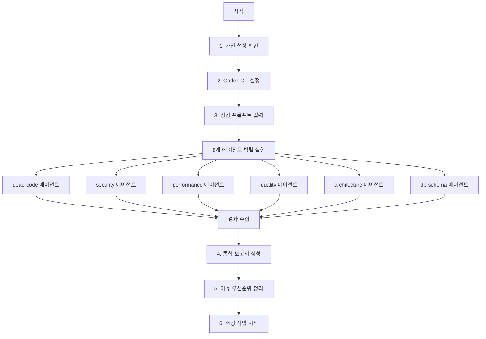

# AI_APEX 워크플로우

## 전체 점검 플로우



## 단계별 가이드

### 1. 사전 설정 확인

```bash
# 필수: .codex/config.toml이 프로젝트 루트에 있는지 확인
ls .codex/config.toml

# 필수: multi_agent 기능이 활성화되어 있는지 확인
# config.toml 안에 [features] multi_agent = true

# 선택: 글로벌 설정에도 multi_agent 활성화
# ~/.codex/config.toml 에 [features] multi_agent = true 추가
```

### 2. Codex CLI 실행

```bash
# 프로젝트 루트에서 Codex 시작
cd "C:\Users\HJSA\Desktop\개발\AI REF"
codex

# 또는 특정 설정으로 실행
codex --enable multi_agent
```

### 3. 점검 프롬프트 입력
→ `prompts.md` 파일의 프롬프트 템플릿을 사용합니다.

### 4. 모니터링

```
# 실행 중인 에이전트 확인
/agent

# 특정 에이전트에 추가 지시
"security 에이전트에게: prometheus-api/app/core/security.py를 더 심층 분석해 줘"
```

### 5. 통합 보고서 확인
모든 에이전트 완료 시 Codex가 자동으로 통합 보고서를 생성합니다.

### 6. 수정 작업
보고서 기반으로 수정 작업을 시작합니다.
Codex에게 수정도 요청할 수 있습니다:

```
통합 보고서에서 Critical 및 High 심각도 항목을 수정해 줘.
각 수정 사항에 대해 테스트도 작성해 줘.
```

## 부분 실행

전체 점검이 아닌 특정 영역만 점검할 때:

### 백엔드만 점검
```
prometheus-api/ 폴더만 대상으로 dead-code, security, performance 에이전트를 실행해 줘.
```

### 프론트엔드만 점검
```
prometheus-app/ 폴더만 대상으로 dead-code, quality, performance 에이전트를 실행해 줘.
```

### 특정 파일만 점검
```
prometheus-api/app/services/gemini_service.py 파일에 대해
security와 quality 에이전트를 실행해 줘.
```
